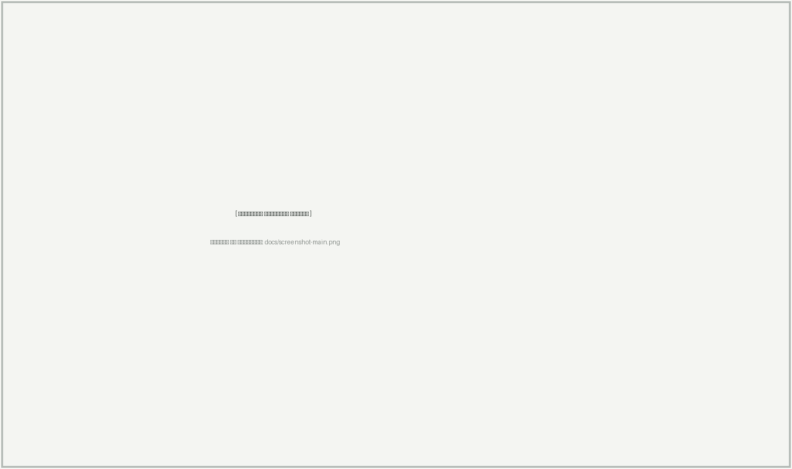
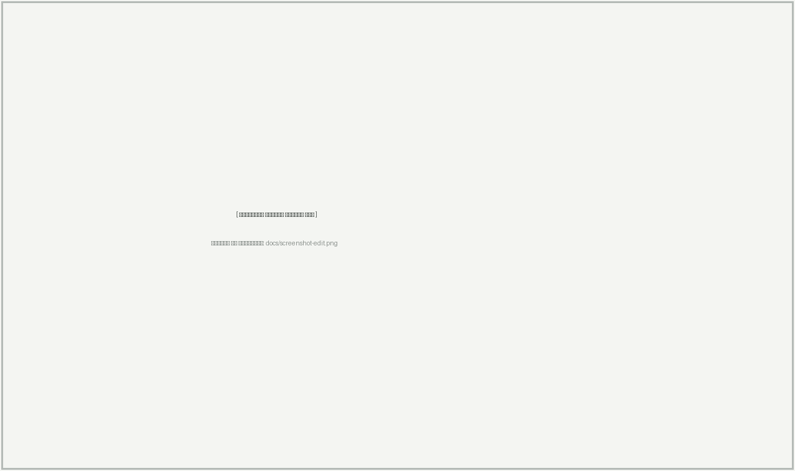

# Учись, вспоминая

**Настраиваемый планировщик самообучения на одном принципе: усваиваешь не когда читаешь, а когда вспоминаешь.**

Офлайновый инструмент в одном HTML-файле плюс метод - для тех, кто учится сам: смена профессии, подготовка к роли, глубокое освоение темы. Открываешь в браузере, интернет не нужен, данные хранятся у тебя. В репозитории: дашборд, методика и колода карточек.

<!-- Замени плейсхолдер на реальный скриншот главного экрана -->


---

## Зачем

Типичная ошибка самоучки - мерить учёбу часами: чем больше просидел, тем лучше. На деле:

- Глубокой концентрации у мозга **4-6 часов в день**, дальше идёт имитация учёбы.
- Перечитывание создаёт **иллюзию знания** - материал узнаётся, но не вспоминается.
- Усвоение даёт **вспоминание и применение**, а не количество прочитанного.

Отсюда главная метрика: не часы за текстом, а **доля того, что вспомнил сам, без подсказки.**

---

## Метод в одном экране

**Три правила**

1. **4-6 часов** глубокой учёбы - потолок в день. Остальное лёгкое: язык, повторение, быт.
2. **Блоки 50/10** - 50 минут фокуса, 10 минут прочь от экрана.
3. **Каждый день - вспоминание.** Что не вспомнил без подсказки - и есть непройденное.

**День - три разных блока:** теория (впитываешь) → проект (производишь артефакт) → кейсы (тренируешь мышление), плюс обязательный прогон карточек.

Полная методика: [`docs/method.md`](docs/method.md).

---

## Возможности дашборда

Главный экран короткий; настройка спрятана внутрь дня (нажми день → «Изменить»).

- **Редактируемое расписание** - правь время каждого блока, сдвигай весь день на ±15/30 минут, переставляй блоки стрелками (при перестановке время пересчитывается встык, длительности сохраняются).
- **«Идеальный день» от подъёма** - впиши, во сколько встал, и день раскладывается от этой точки, сохраняя длительности блоков. Проснулся не по графику - собрал день под реальность за секунды.
- **Свои блоки** - добавляй собственные (имя, описание, цвет) поверх готовых.
- **Редактируемые описания** - и у дня, и у любого блока. «Восстановить исходное» откатывает.
- **Сброс к шаблону** - вернуть день к дефолту одним тапом.
- **Индикатор баланса и подсказки** - показывает, сколько глубокой работы набралось (цель 4-6ч), и мягко предупреждает: нет блока вспоминания, тяжёлая теория после обеда, два фокус-блока без паузы.
- **Перенос между устройствами** - экспорт/импорт кодом, файлом или ссылкой (состояние зашивается прямо в URL, без сервера). Формат кода и как собрать его скриптом или через ИИ - [`docs/generate-transfer-code.md`](docs/generate-transfer-code.md).

<!-- Замени плейсхолдер на реальный скриншот (или GIF) режима правки -->


---

## Что в репозитории

```
.
├── docs/
│   ├── index.html   # дашборд (офлайн, один файл; GitHub Pages отдаёт его отсюда)
│   └── method.md    # методика целиком
├── anki/
│   └── pm-interview-cards.txt   # колода из 13 карточек-принципов (пример наполнения)
├── README.md
└── LICENSE
```

---

## Как пользоваться

**Офлайн, сразу:** скачай репозиторий и открой `docs/index.html` в браузере.

**Онлайн (GitHub Pages):** Settings → Pages → Source: `main`, папка `/docs`. Через минуту дашборд доступен по адресу `https://<ник>.github.io/<репозиторий>/`.

**Карточки:** в десктопном Anki - File → Import → `anki/pm-interview-cards.txt` (разделитель - табуляция, тип заметки «Базовый»), затем синхронизация с телефоном.

---

## Как адаптировать под себя

Дашборд заполнен под пример - самообучение на продакт-менеджмент. Метод от домена не зависит: форкни и подставь своё.

- **Блоки** правь и создавай под свою область - суть та же: впитываешь → производишь → тренируешь мышление.
- **Времена и дни** - шаблон, а не предписание. Собери «идеальный день» от своего подъёма и двигай как удобно.
- **Колода** - замени карточки-принципы на свои: одна карточка - одна мысль, лицо формулируй как вопрос.

Расписание - это леса, а не рельсы: система работает на дистанции, пропущенный день ничего не рушит.

---

## Почему один файл и без сервера

Осознанный инженерный выбор, а не ограничение:

- **Один HTML-файл, ноль зависимостей** (сингл-файл - один файл). Скачал, открыл - работает. Нечего собирать и устанавливать.
- **Полностью офлайн** - шрифты вшиты, интернет не нужен, ничего никуда не уходит.
- **Данные локально** (localStorage - локалсторидж - хранилище браузера). Плюсы: приватность и скорость, нет аккаунтов. Минус: память привязана к устройству и браузеру - между телефоном и компом не синхронится. Для переноса есть экспорт кодом/файлом/ссылкой.
- **Нет бэкенда и учёток** - нечему ломаться и утекать.

---

## Лицензия

[MIT](LICENSE) - используй, меняй, форкай свободно.
